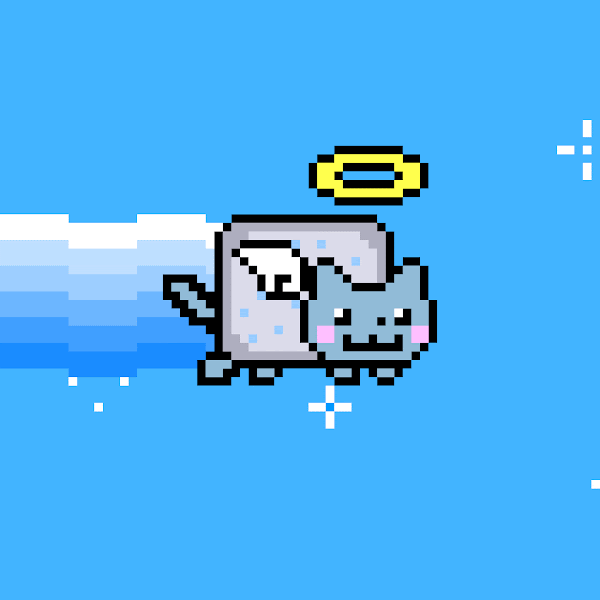

<h1 align="center">Hi 👋, I'm Nguyen Nhu Tu</h1>

<h3 align="center">A passionate developer from Vietnam </h3>

   

- ✍ I'm a student of: [Ho Chi Minh city University of Technology and Education](https://hcmute.edu.vn) (HCMUTE).

- 🌱 I’m currently learning **C#/.NET Framework**

## 📫 How to reach me:

  
   
   
  
  </a>
  

## Skills:

  <!---
   
  
  
  
  
  
  --->
  
  
  
  <!---
  
  
  
  --->

<table style="width:100%;">
  <tr>
    <td>
      
      
    </td>
    <td>
      
 
        
      

    </td>
  </tr>
</table>

  

 

  

